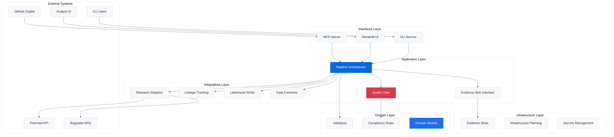
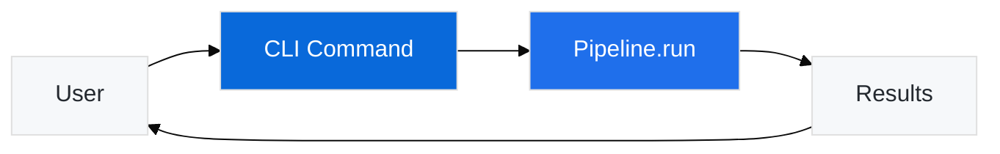
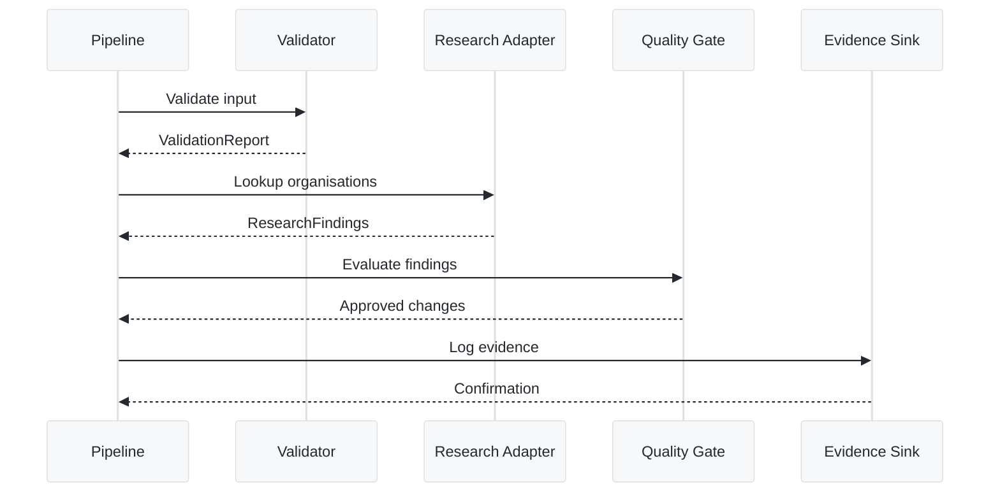
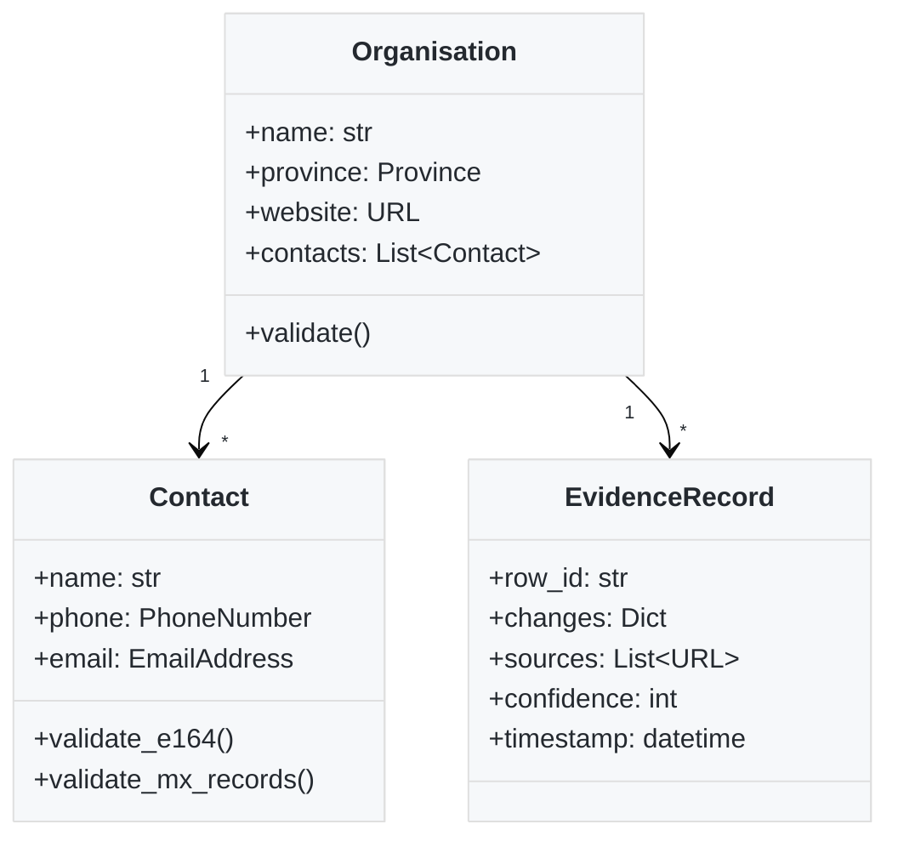
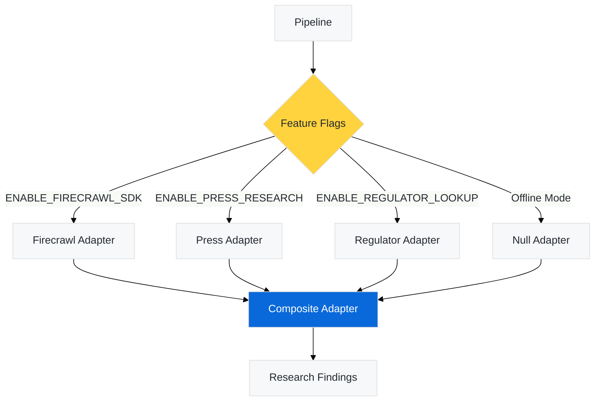
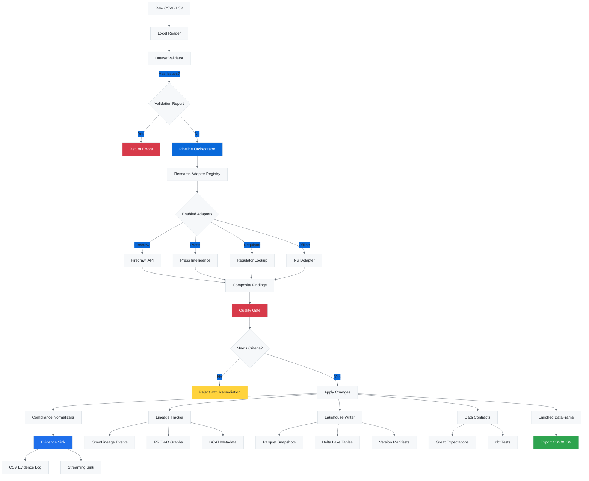
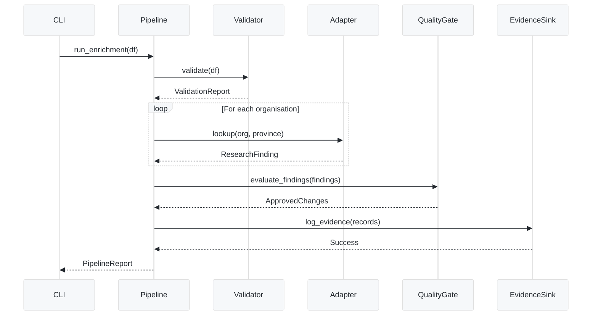
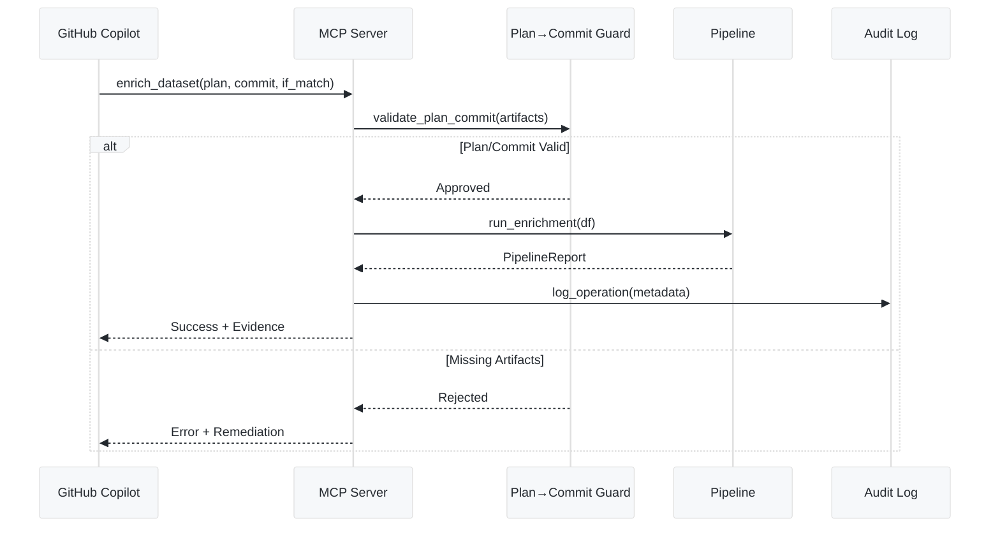
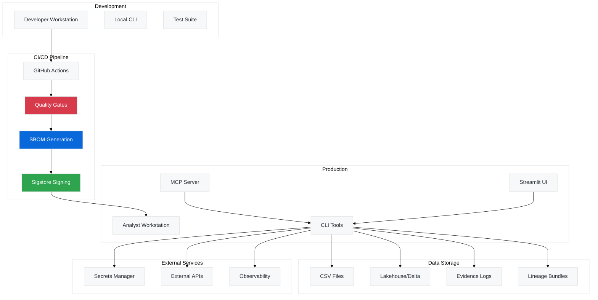

# Architecture Overview

Watercrawl follows a **hexagonal (ports and adapters) architecture** with clear separation of concerns, enabling testability, extensibility, and maintainability.

## High-Level System Architecture



## Layered Architecture

Watercrawl is organized into six distinct layers, each with specific responsibilities:

### 1. Interfaces Layer (`firecrawl_demo.interfaces`)

**Purpose**: External entry points for humans and AI agents

**Components**:
- **CLI** (`interfaces.cli`): Analyst-facing commands for validation, enrichment, and contracts
- **MCP Server** (`interfaces.mcp`): Model Context Protocol server for GitHub Copilot integration
- **Analyst UI** (`interfaces.ui`): Streamlit-based web interface (optional dependency)

**Key Principle**: Interfaces depend on the application layer but never directly on infrastructure



### Crawlkit Modules (`crawlkit`)

Feature-flagged Crawlkit fetch, distill, extract, and Celery orchestrators replace the legacy Firecrawl demos. Enable `FEATURE_ENABLE_CRAWLKIT` to exercise the adapters locally; set `FEATURE_ENABLE_FIRECRAWL_SDK` only when you are ready to run the optional SDK. The compatibility shim exposes `/crawlkit/crawl`, `/crawlkit/markdown`, and `/crawlkit/entities` via FastAPI (`firecrawl_demo.interfaces.cli:create_app`) so automation clients can reuse the same surfaces.

### 2. Application Layer (`firecrawl_demo.application`)

**Purpose**: Orchestrate workflows and enforce business rules

**Components**:
- **Pipeline** (`application.pipeline`): Main enrichment orchestrator
- **Quality Gate** (`application.quality`): Validates changes before applying them
- **Interfaces** (`application.interfaces`): Abstract interfaces for evidence sinks, research adapters

**Key Principle**: Application layer coordinates domain logic without knowing about persistence details



### 3. Domain Layer (`firecrawl_demo.domain`)

**Purpose**: Core business logic and rules (framework-independent)

**Components**:
- **Models** (`domain.models`): Data classes for organisations, contacts, evidence
- **Validation** (`domain.validation`): Dataset validation rules
- **Compliance** (`domain.compliance`): POPIA, E.164, South African taxonomy rules

**Key Principle**: Pure business logic with no framework dependencies



### 4. Integrations Layer (`firecrawl_demo.integrations`)

**Purpose**: Connect to external systems and optional features

**Components**:
- **Research Adapters** (`integrations.adapters`): Firecrawl, press, regulator lookups
- **Lineage** (`integrations.lineage`): OpenLineage, PROV-O, DCAT tracking
- **Lakehouse** (`integrations.lakehouse`): Parquet snapshots, Delta Lake (optional)
- **Contracts** (`integrations.contracts`): Great Expectations + dbt integration
- **Plugin Registry** (`integrations.integration_plugins`): Centralized plugin discovery

**Key Principle**: All integrations are optional and feature-flagged



### 5. Infrastructure Layer (`firecrawl_demo.infrastructure`)

**Purpose**: Implement persistence and deployment concerns

**Components**:
- **Evidence Sinks** (`infrastructure.evidence`): CSV, streaming, hybrid implementations
- **Planning** (`infrastructure.planning`): Infrastructure-as-code scaffolding
- **Secrets** (`infrastructure.secrets`): AWS, Azure, environment variable backends

**Key Principle**: Infrastructure adapts to application interfaces

### 6. Core Utilities (`firecrawl_demo.core`)

**Purpose**: Shared utilities and configuration

**Components**:
- **Configuration** (`core.config`): Environment variables, feature flags
- **Excel I/O** (`core.excel`): CSV/XLSX readers and writers
- **Constants** (`core.constants`): Shared enums and taxonomies

## Complete Data Flow



## Extensibility Points

Watercrawl is designed for extension at multiple levels:

### 1. Research Adapters

Implement the `ResearchAdapter` protocol to add new data sources:

```python
from firecrawl_demo.integrations.adapters.research import (
    ResearchAdapter, 
    ResearchFinding
)

class CustomAdapter(ResearchAdapter):
    async def lookup(
        self, 
        organisation: str, 
        province: str
    ) -> ResearchFinding | None:
        # Your implementation
        return ResearchFinding(
            website="https://example.com",
            sources=["https://official.source", "https://secondary.source"],
            confidence=85
        )

# Register with the plugin system
from firecrawl_demo.integrations.adapters.research.registry import register_adapter
register_adapter("custom", lambda ctx: CustomAdapter())
```

### 2. Evidence Sinks

Implement `EvidenceSink` interface for custom logging:

```python
from firecrawl_demo.application.interfaces import EvidenceSink, EvidenceRecord

class KafkaEvidenceSink(EvidenceSink):
    async def log_evidence(self, record: EvidenceRecord) -> None:
        # Send to Kafka topic
        await self.producer.send("evidence", record.to_dict())
```

### 3. Validation Rules

Extend domain validators for custom compliance:

```python
from firecrawl_demo.domain.validation import DatasetValidator

class CustomValidator(DatasetValidator):
    def validate_custom_field(self, df: pd.DataFrame) -> List[ValidationIssue]:
        # Custom validation logic
        return issues
```

## Component Communication

### Synchronous Flow (CLI/Direct)



### Asynchronous Flow (MCP/AI-Assisted)



## Deployment Architecture



## Design Principles

1. **Separation of Concerns**: Each layer has a single, well-defined responsibility
2. **Dependency Inversion**: High-level modules don't depend on low-level modules
3. **Interface Segregation**: Clients depend only on interfaces they use
4. **Feature Flags**: Optional functionality is gated by environment variables
5. **Evidence-First**: All changes require ≥2 sources, including ≥1 official
6. **Compliance by Default**: POPIA, E.164, and SACAA rules are enforced automatically
7. **Testability**: Pure functions and dependency injection enable comprehensive testing
8. **Observability**: Lineage, metrics, and audit logs for all operations

## Technology Decisions

See [Architecture Decision Records (ADRs)](/adr/) for detailed rationales:

- [ADR 0001: Architecture Boundaries](/adr/0001-architecture-boundaries/) - Package structure
- [ADR 0002: Domain/Application Separation](/adr/0002-domain-application-separation/) - Layer boundaries
- [ADR 0003: Threat Model & STRIDE/MITRE](/adr/0003-threat-model-stride-mitre/) - Security design

## Next Steps

- **Developers**: Review [CLI Guide](/cli/) for available commands
- **Architects**: Study [Data Quality](/data-quality/) methodology
- **Security**: Examine [Operations](/operations/) for hardening procedures
- **Contributors**: Check [CONTRIBUTING.md](https://github.com/IAmJonoBo/watercrawl/blob/main/CONTRIBUTING.md)
    F --> E
    E --> G[domain.compliance Normalisers]
    E --> H[application.interfaces EvidenceSink]
    H --> I[infrastructure.evidence Implementations]
    E --> J[Enriched DataFrame]
    J --> K[Exports & Lakehouse]
```

## Extensibility

- Implement new `ResearchAdapter` factories for additional data sources.
- Provide alternative `EvidenceSink` implementations (Kafka, REST, etc.).
- Extend `Pipeline.run_task` with automation shortcuts.
- Capture decisions in ADRs as the architecture evolves.

### Research Adapter Registry

The registry (`firecrawl_demo.integrations.research.registry`) discovers adapters without editing the pipeline:

1. Implement the `ResearchAdapter` protocol.
2. Register the factory with `register_adapter()`.
3. Configure execution order via `RESEARCH_ADAPTERS` or an adapters file.
4. `load_enabled_adapters()` resolves factories with feature-flag checks and falls back to a Null adapter when every factory opts out.

### Infrastructure Plan Scaffold

`firecrawl_demo.infrastructure.planning` assembles crawler, observability, policy, and plan→commit expectations. Use `build_infrastructure_plan()` to produce a frozen snapshot for documentation, CI assertions, or MCP tooling.

### Lineage & Lakehouse Services

- `firecrawl_demo.integrations.lineage` records OpenLineage, PROV-O, and DCAT artefacts.
- `firecrawl_demo.integrations.lakehouse` snapshots curated tables to Parquet with manifest metadata, paving the way for Delta Lake/Iceberg or DVC/lakeFS integrations.
