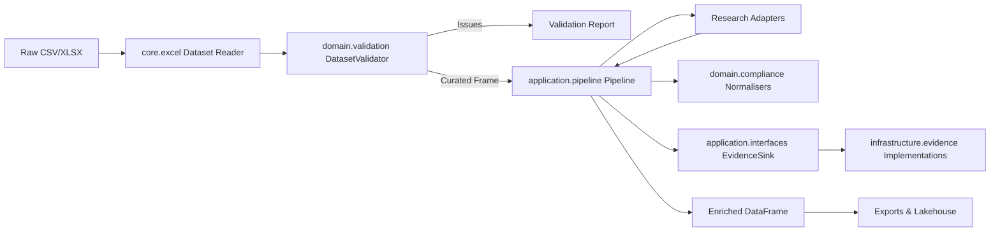

# Architecture Overview

## Layered Design

1. **Core Utilities** (`firecrawl_demo.core`)
   - Configuration, Excel helpers, and shared constants.
2. **Domain Layer** (`firecrawl_demo.domain`)
   - Canonical models, validation rules, and compliance heuristics.
   - Emits structured records that stay independent from persistence.
3. **Application Layer** (`firecrawl_demo.application`)
   - Pipeline orchestration, quality gates, and progress listeners.
   - Publishes interfaces so pipelines and evidence sinks can be swapped without breaking callers.
4. **Integrations** (`firecrawl_demo.integrations`)
   - Research adapters, lineage emitters, lakehouse writers, and contract runners wired through feature flags.
5. **Infrastructure** (`firecrawl_demo.infrastructure`)
   - Evidence sink implementations and infrastructure planning scaffolds that back the application interfaces.
6. **Interfaces** (`firecrawl_demo.interfaces`)
   - CLI, analyst UI, and MCP surfaces that bind the application layer to humans and GitHub Copilot.

> `firecrawl_demo.domain` captures business invariants, `firecrawl_demo.application` orchestrates workflows, `firecrawl_demo.infrastructure` persists artefacts, and `firecrawl_demo.integrations` connects optional systems. Production builds still exclude development directories for a minimal wheel.

## Data Flow

## Extensibility

- Implement new `ResearchAdapter` factories for additional data sources.
- Provide alternative `EvidenceSink` implementations (Kafka, REST, etc.).
- Extend `Pipeline.run_task` with automation shortcuts.
- Capture decisions in ADRs as the architecture evolves.

### Research Adapter Registry

The registry (`firecrawl_demo.integrations.research.registry`) discovers adapters without editing the pipeline:

1. Implement the `ResearchAdapter` protocol.
2. Register the factory with `register_adapter()`.
3. Configure execution order via `RESEARCH_ADAPTERS` or an adapters file.
4. `load_enabled_adapters()` resolves factories with feature-flag checks and falls back to a Null adapter when every factory opts out.

### Infrastructure Plan Scaffold

`firecrawl_demo.infrastructure.planning` assembles crawler, observability, policy, and plan→commit expectations. Use `build_infrastructure_plan()` to produce a frozen snapshot for documentation, CI assertions, or MCP tooling.

### Lineage & Lakehouse Services

- `firecrawl_demo.integrations.lineage` records OpenLineage, PROV-O, and DCAT artefacts.
- `firecrawl_demo.integrations.lakehouse` snapshots curated tables to Parquet with manifest metadata, paving the way for Delta Lake/Iceberg or DVC/lakeFS integrations.
