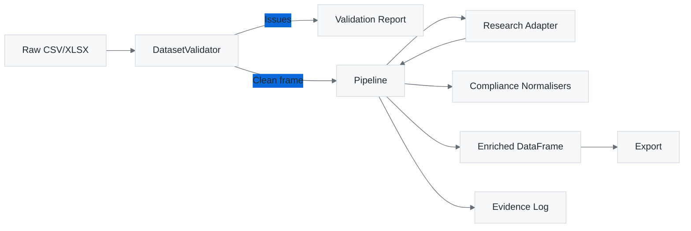

## Layered Design

1. **Dataset Ingestion** (`firecrawl_demo.core.excel`)
   - Handles CSV/XLSX parity with a unified reader/writer.
   - Normalises sheet naming and preserves canonical column order.
2. **Validation Layer** (`firecrawl_demo.core.validation`)
   - Enforces South African provincial lists and ACES status taxonomy.
   - Emits structured `ValidationIssue` instances for UI/automation consumption.
3. **Research Adapter Layer** (`firecrawl_demo.integrations.research`)
   - Provides a protocol-driven interface so tests can inject deterministic findings while production can swap in Firecrawl or OSINT clients.
   - `TriangulatingResearchAdapter` merges Firecrawl, regulator, press, and directory intelligence governed by feature toggles.
4. **Compliance Utilities** (`firecrawl_demo.core.compliance`)
   - Normalises phone numbers to +27 E.164, verifies email domains against official websites, and calculates confidence scores.
5. **Data Quality Contracts** (`analytics/`, `great_expectations/`)
   - dbt models for data transformation and contracts.
   - Great Expectations suites for automated validation and quality checks.
6. **Pipeline Orchestrator** (`firecrawl_demo.core.pipeline`)
   - Applies validation, enrichment, evidence logging, and metrics collection.
   - Generates `PipelineReport` objects for CLI/MCP consumers.
7. **Audit Sinks** (`firecrawl_demo.core.audit`)
   - `EvidenceSink` protocol decouples evidence persistence from the pipeline.
   - `CSVEvidenceSink` preserves the legacy append-to-file behaviour for analysts.
   - `StreamingEvidenceSink` logs Kafka/REST publication stubs so future streaming graphs can subscribe without modifying the pipeline.
8. **Interfaces**
   - **CLI** (`firecrawl_demo.interfaces.cli`): human-friendly commands for validation and enrichment.
   - **MCP Server** (`firecrawl_demo.interfaces.mcp.server`): JSON-RPC surface for GitHub Copilot automation.

> **Package boundaries.** `firecrawl_demo.core` owns the enrichment contract, `firecrawl_demo.integrations` wraps optional adapters and metadata services, `firecrawl_demo.governance` isolates safety and secrets logic, `analytics/` contains dbt data contracts, `great_expectations/` holds data quality suites, and `firecrawl_demo.interfaces` exposes human/automation entrypoints. Production wheels exclude `codex/`, `dev/`, and other development directories via `pyproject.toml` so deployments only ship the hardened packages.

## Data Flow

## Extensibility Points

- Implement a new `ResearchAdapter` to integrate different data sources (e.g., SACAA APIs, LinkedIn scraping, commercial datasets).
- Override `Pipeline.run_task` to expose additional automation tasks (e.g., province-only audits).
- Extend MkDocs with ADRs to capture decision history as the stack evolves.
- Swap in a custom `EvidenceSink` to emit audit events to Kafka, REST webhooks, or other telemetry when the graph roadmap graduates from stubs to production.

### Research Adapter Registry

The `firecrawl_demo.integrations.research.registry` module centralises adapter discovery so new intelligence sources can be added without editing the core pipeline.

1. Author an adapter that implements the `ResearchAdapter` protocol (expose a `lookup(organisation, province)` method returning a `ResearchFinding`).
2. Register it during import with `register_adapter("my-adapter", my_factory)`. Factories receive an `AdapterContext` and should return a new adapter instance (or `None` when disabled).
3. Declare the execution order with configuration:
   - `RESEARCH_ADAPTERS="firecrawl,my-adapter,null"` for quick overrides.
   - Point `RESEARCH_ADAPTERS_FILE` to a YAML/TOML file containing an `adapters` list for more complex stacks.
4. When `load_enabled_adapters()` runs, the registry handles deduplication and feature-flag checks; `build_research_adapter()` ensures a Null adapter is used if every factory opts out.

This registry keeps `build_research_adapter()` thin while allowing optional modules (e.g., press intelligence, regulator lookups, ML enrichers) to live in their own packages.

### Exemplar adapters

- `firecrawl_demo.integrations.research.exemplars` ships offline-friendly implementations for regulator (`RegulatorRegistryAdapter`), press (`PressMonitoringAdapter`), and ML (`MLInferenceAdapter`) intelligence.
- They register themselves with the adapter registry on import and are part of the default adapter chain (`regulator, press, ml, firecrawl, null`).
- Each adapter respects the relevant feature flags (`FEATURE_ENABLE_REGULATOR_LOOKUP`, `FEATURE_ENABLE_PRESS_RESEARCH`, `FEATURE_ENABLE_ML_INFERENCE`) so analysts can toggle data sources without editing code.
- The exemplar dataset is deterministic, ensuring unit tests and dry-run demos can rely on consistent findings without touching external networks.

## Infrastructure Plan Scaffold

The `firecrawl_demo.infrastructure.planning` module provides an `InfrastructurePlan` dataclass that aggregates crawler, observability, policy, and plan→commit expectations into a single contract.

- **CrawlerPlan** captures the frontier backend, scheduling policy, politeness delays, depth limits, trap-rule file, and user agent. Defaults map to a Scrapy/priority queue stack while allowing overrides via environment variables (`CRAWLER_*`).
- **ObservabilityPlan** defines Kubernetes-style probe paths, SLO thresholds, and alert routes. The defaults surface `/healthz`, `/readyz`, and `/startupz` endpoints with a 99.5% availability target. Teams can raise thresholds by setting `OBSERVABILITY_*` and `SLO_*` values.
- **PolicyPlan** records the OPA bundle path, decision namespace, and enforcement mode so MCP/CLI tooling can fail closed when `OPA_ENFORCEMENT_MODE=enforce`. Caching is tunable via `OPA_CACHE_SECONDS`.
- **PlanCommitContract** encodes the plan→commit guardrails for automation, including the audit topic used by the evidence sink and optional force-commit escape hatches.

The planner is intentionally declarative—call `build_infrastructure_plan()` to obtain a frozen snapshot suitable for documentation exports, MCP tool manifests, or CI assertions that the environment is wired correctly before agents are allowed to crawl.

### Lineage & Lakehouse Services

- `firecrawl_demo.integrations.lineage` captures OpenLineage, PROV-O, and DCAT artefacts for each pipeline run so provenance bundles accompany enriched datasets.
- `firecrawl_demo.integrations.lakehouse` provides a local lakehouse writer that snapshots curated tables to Parquet with manifest metadata, forming the foundation for future Delta Lake/Iceberg and DVC/lakeFS integrations.
