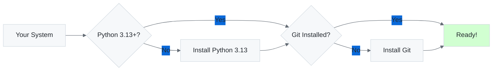
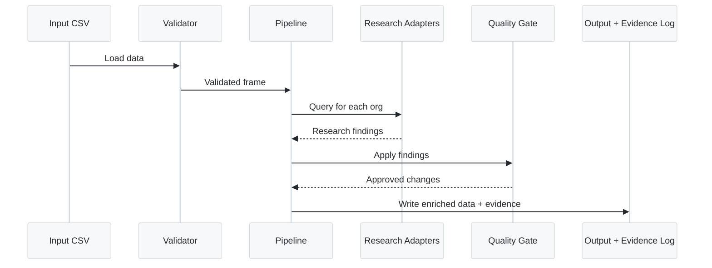

This guide will walk you through setting up Watercrawl and running your first data enrichment pipeline.

## Prerequisites

Before you begin, ensure you have the following installed:

- **Python 3.13+** (minimum 3.13, maximum 3.14)
- **Git** for version control
- **Node.js 20+** (for documentation tooling)
- **8GB+ RAM** recommended for processing large datasets

### System Requirements



## Installation

### Step 1: Clone the Repository

```bash
git clone https://github.com/IAmJonoBo/watercrawl.git
cd watercrawl
```

### Step 2: Bootstrap the Environment

Watercrawl includes an automated bootstrap script that sets up your development environment:

```bash
# Dry run to see what will be installed
python -m scripts.bootstrap_env --dry-run

# Run the full bootstrap
python -m scripts.bootstrap_env
```

The bootstrap process will:

1. Install `uv` toolchain manager
2. Set up Poetry for dependency management
3. Create a virtual environment (`.venv/`)
4. Install all Python dependencies
5. Set up pre-commit hooks
6. Install Node.js dependencies for documentation

:::tip[Alternative: Manual Setup]
If you prefer manual control:

```bash
# Install Poetry
pip install poetry

# Install dependencies
poetry install --no-root --with dev

# Install pre-commit hooks
poetry run pre-commit install
```
:::

### Step 3: Verify Installation

Run the test suite to ensure everything is working correctly:

```bash
# Run quick validation
poetry run python -m apps.automation.cli qa all --dry-run

# Run full test suite
poetry run pytest -q
```

You should see output indicating all tests pass.

## Configuration

### Environment Variables

Create a `.env` file in the project root (use `.env.example` as a template):

```bash
cp .env.example .env
```

Key configuration options:

```ini
# Feature Flags
FEATURE_ENABLE_FIRECRAWL_SDK=0  # Set to 1 to enable live Firecrawl API
ALLOW_NETWORK_RESEARCH=0         # Set to 1 to allow network lookups
FEATURE_ENABLE_PRESS_RESEARCH=1  # Enable press intelligence
FEATURE_ENABLE_REGULATOR_LOOKUP=1 # Enable regulator lookups
FEATURE_INVESTIGATE_REBRANDS=1   # Enable rebrand detection

# Profile Selection
REFINEMENT_PROFILE=za_flight_schools  # South African flight schools profile

# Secrets Backend
SECRETS_BACKEND=env  # Options: env, aws, azure

# API Keys (if using Firecrawl SDK)
# FIRECRAWL_API_KEY=your_api_key_here
```

:::caution[Offline Mode]
By default, Watercrawl operates in **offline mode** with deterministic adapters. This ensures reproducible results during development and testing. To enable live network research, set both:
- `FEATURE_ENABLE_FIRECRAWL_SDK=1`
- `ALLOW_NETWORK_RESEARCH=1`
:::

## Your First Enrichment

### Sample Data

Watercrawl includes a sample dataset at `data/sample.csv` for testing:

```bash
# View the sample data
head data/sample.csv
```

Expected columns:
- `Name of Organisation`
- `Province`
- `Status`
- `Website URL`
- `Contact Person`
- `Contact Number`
- `Contact Email Address`

### Step 1: Validate the Data

Before enrichment, validate your dataset:

```bash
poetry run python -m apps.analyst.cli validate data/sample.csv --format json
```

This will check for:
- South African provincial taxonomy compliance
- Phone number formatting (E.164)
- Email domain validation (MX records)
- Required fields and data types

### Step 2: Enrich the Dataset

Run the enrichment pipeline:

```bash
poetry run python -m apps.analyst.cli enrich \
  data/sample.csv \
  --output data/enriched.csv \
  --evidence-log data/evidence_log.csv
```

**What happens during enrichment:**



### Step 3: Review Evidence Log

The evidence log records all changes with source citations:

```bash
cat data/evidence_log.csv
```

Each entry includes:
- `RowID`: Row identifier
- `Organisation`: Organisation name
- `Changes`: What was updated
- `Sources`: URLs of evidence (minimum 2, including 1 official)
- `Confidence`: Confidence score (0-100)
- `Timestamp`: When the change was made

### Step 4: Validate Data Contracts

Run data quality contracts:

```bash
poetry run python -m apps.analyst.cli contracts data/enriched.csv --format json
```

This executes:
- **Great Expectations** suites for data quality
- **dbt** tests for schema compliance
- **Graph semantics** validation
- **Drift detection** checks

## Next Steps

Now that you have Watercrawl running, explore these areas:

### Tutorials
- [First Enrichment Tutorial](/guides/tutorials/first-enrichment/) - Detailed walkthrough
- [Working with Profiles](/guides/tutorials/profiles/) - Customize for your domain
- [Setting up MCP](/guides/tutorials/mcp-setup/) - Enable GitHub Copilot integration

### How-To Guides
- [CLI Command Reference](/cli/) - Complete command documentation
- [Troubleshooting Guide](/guides/troubleshooting/) - Common issues and solutions
- [Advanced Configuration](/guides/advanced-configuration/) - Performance tuning

### Understanding Watercrawl
- [Architecture Overview](/architecture/) - System design
- [Data Quality Methodology](/data-quality/) - Research strategies
- [Lineage & Provenance](/lineage-lakehouse/) - Data tracking

## Common Issues

### Poetry Not Found

If `poetry` command is not found after bootstrap:

```bash
# Install Poetry manually
curl -sSL https://install.python-poetry.org | python3 -

# Add to PATH (Linux/macOS)
export PATH="$HOME/.local/bin:$PATH"
```

### Python Version Mismatch

Ensure you're using Python 3.13+:

```bash
python --version  # Should show 3.13.x

# If not, use pyenv to install
pyenv install 3.13.0
pyenv local 3.13.0
```

### Dependency Installation Fails

If dependency installation fails:

```bash
# Clear Poetry cache
poetry cache clear --all .

# Reinstall
poetry install --no-root --with dev
```

### Test Failures

If tests fail on initial setup:

```bash
# Check for environment issues
poetry run python -m scripts.collect_problems.py

# Review problems report
cat problems_report.json
```

## Getting Help

- **Documentation**: Browse the full documentation at [watercrawl.io](https://iamjonobo.github.io/watercrawl/)
- **Issues**: [GitHub Issues](https://github.com/IAmJonoBo/watercrawl/issues)
- **Contributing**: See [CONTRIBUTING.md](https://github.com/IAmJonoBo/watercrawl/blob/main/CONTRIBUTING.md)

---

**Congratulations!** You've successfully set up Watercrawl and run your first enrichment pipeline. Continue with the [First Enrichment Tutorial](/guides/tutorials/first-enrichment/) for a deeper dive.
