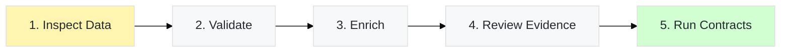
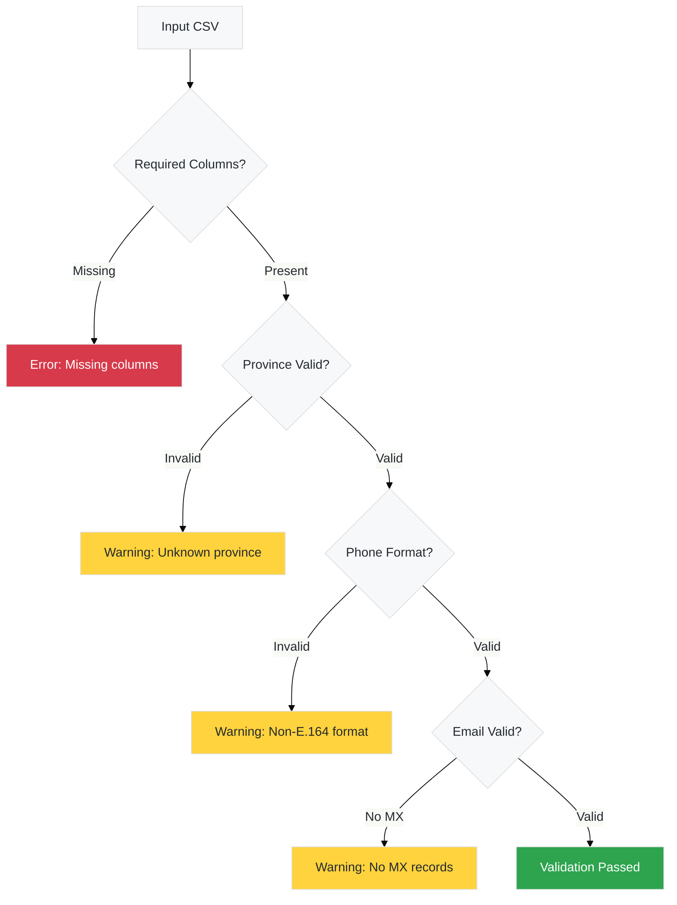
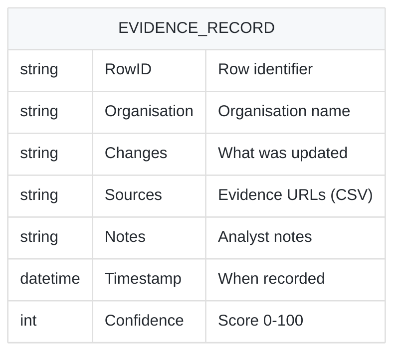
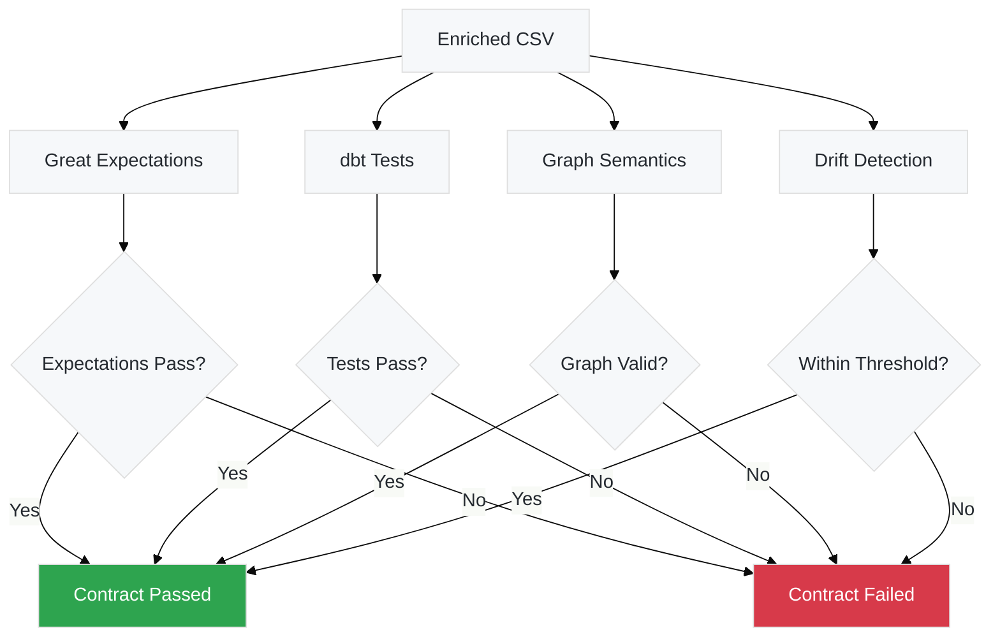

# Your First Data Enrichment

This tutorial walks you through enriching a South African flight school dataset from raw data to validated, evidence-backed records.

## Prerequisites

Before starting, ensure you have:

- ✅ Watercrawl installed (see [Getting Started](/guides/getting-started/))
- ✅ Poetry environment activated
- ✅ Sample data at `data/sample.csv`

## Tutorial Overview

We'll enrich a small dataset in five stages:



Estimated time: **15 minutes**

## Stage 1: Inspect the Input Data

First, let's examine the sample dataset structure:

```bash
# View first few rows
head -5 data/sample.csv

# Count total rows
wc -l data/sample.csv
```

**Expected columns:**

| Column | Description | Example |
|--------|-------------|---------|
| Name of Organisation | Flight school name | "SA Flight Academy" |
| Province | South African province | "Gauteng" |
| Status | Verification status | "Candidate" |
| Website URL | Organisation website | "https://example.aero" |
| Contact Person | Primary contact | "Jane Smith" |
| Contact Number | Phone in E.164 | "+27123456789" |
| Contact Email Address | Contact email | "info@example.aero" |

:::tip[Data Format]
The CSV must include these exact column names (case-sensitive). Use UTF-8 encoding for proper handling of special characters.
:::

### Understanding Status Values

Valid status values in the South African flight schools profile:

- **Verified**: All details confirmed with ≥2 sources, including ≥1 official
- **Candidate**: Partially verified, missing phone or named email
- **Needs Review**: Ambiguous data requiring analyst attention
- **Duplicate**: Identified as duplicate entry
- **Do Not Contact (Compliance)**: POPIA s69 risk flagged

## Stage 2: Validate the Dataset

Before enrichment, validate data quality:

```bash
poetry run python -m apps.analyst.cli validate data/sample.csv \
  --format json \
  --progress
```

**What validation checks:**



### Review Validation Results

```bash
# Pretty-print JSON validation report
poetry run python -m apps.analyst.cli validate data/sample.csv \
  --format json | jq '.issues'
```

**Common validation issues:**

| Issue Type | Cause | Fix |
|------------|-------|-----|
| `province_invalid` | Province not in SA taxonomy | Update to valid province (see [Reference](/reference/configuration/)) |
| `phone_format_invalid` | Phone not in E.164 format | Convert to `+27XXXXXXXXX` |
| `email_domain_no_mx` | Domain has no MX records | Verify domain or use alternate email |
| `required_field_missing` | Empty required column | Fill in missing data |

:::note[Proceeding with Warnings]
Validation warnings don't prevent enrichment, but they're logged in the evidence log for manual review.
:::

## Stage 3: Enrich the Dataset

Now run the enrichment pipeline:

```bash
poetry run python -m apps.analyst.cli enrich \
  data/sample.csv \
  --output data/enriched.csv \
  --evidence-log data/evidence_log.csv \
  --progress
```

**What happens during enrichment:**

1. **Load & Validate**: Input CSV is loaded and pre-validated
2. **Research Phase**: For each organisation, research adapters query multiple sources:
   - Regulator databases (SACAA)
   - Press intelligence
   - Directory services
   - Firecrawl API (if enabled)
3. **Triangulation**: Findings are merged and confidence scores assigned
4. **Quality Gate**: Changes are evaluated against quality criteria:
   - ≥2 sources required
   - ≥1 official/regulatory source required
   - Fresh evidence required for high-risk changes
   - Confidence ≥70 required
5. **Application**: Approved changes are applied to the dataset
6. **Evidence Logging**: All changes are recorded with source citations
7. **Compliance**: Final normalization (E.164 phones, URL cleanup, etc.)

### Understanding Pipeline Metrics

After enrichment completes, you'll see metrics:

```
Pipeline Report:
  Total rows processed: 50
  Rows updated: 35
  Rows rejected: 5
  Rows unchanged: 10
  Quality rejections: 5
  Evidence records: 87
  Adapter failures: 0
  Sanity issues: 0
  Drift alerts: 0
```

**Key metrics:**

- **Rows updated**: Successfully enriched with approved changes
- **Rows rejected**: Failed quality gate (low confidence, insufficient sources)
- **Quality rejections**: Changes blocked by quality gate
- **Evidence records**: Total evidence entries logged
- **Adapter failures**: Research adapter errors (should be 0)
- **Sanity issues**: Data quality warnings

:::caution[Quality Rejections]
If you see high quality rejections, this means enrichment findings didn't meet evidence requirements. This is **expected** in offline mode with deterministic adapters. Enable network research for live data.
:::

## Stage 4: Review Evidence Log

The evidence log records all enrichment decisions:

```bash
# View evidence log
cat data/evidence_log.csv

# Count evidence entries
wc -l data/evidence_log.csv

# View specific organisation's evidence
grep "SA Flight Academy" data/evidence_log.csv
```

**Evidence Log Schema:**



**Example evidence entry:**

```csv
RowID,Organisation,Changes,Sources,Notes,Timestamp,Confidence
001,SA Flight Academy,"Updated website to https://saflight.aero, Updated contact email to info@saflight.aero","https://www.sacaa.co.za/register,https://saflight.aero/contact",Fresh official source corroboration,2025-10-21T15:30:00Z,95
```

### Quality Indicators

Check evidence quality:

```bash
# Count entries with <2 sources
awk -F',' 'NR>1 {split($4,a,";"); if(length(a)<2) print}' data/evidence_log.csv | wc -l

# Count entries with confidence <70
awk -F',' 'NR>1 && $7<70 {print}' data/evidence_log.csv | wc -l
```

:::tip[Evidence Best Practices]
- Each change should have ≥2 sources, including ≥1 official (gov.za, sacaa.co.za, etc.)
- Confidence scores reflect source authority and consistency
- Notes explain reasoning, especially for manual overrides
:::

## Stage 5: Run Data Contracts

Validate the enriched data against quality contracts:

```bash
poetry run python -m apps.analyst.cli contracts \
  data/enriched.csv \
  --format json
```

**Contract validation includes:**



### Great Expectations Checks

```bash
# View expectation results
cat data/contracts/latest/great_expectations/validation_results.json | jq '.'

# Common expectations:
# - expect_column_values_to_not_be_null (required fields)
# - expect_column_values_to_be_in_set (province taxonomy)
# - expect_compound_columns_to_be_unique (no duplicates)
# - expect_column_to_exist (schema integrity)
```

### dbt Test Results

```bash
# View dbt test results
ls -la data_contracts/analytics/target/

# Common dbt tests:
# - not_null (required fields)
# - unique (primary keys)
# - accepted_values (taxonomies)
# - relationships (foreign keys)
```

### Contract Artifacts

After running contracts, artifacts are archived:

```bash
# List contract artifacts
ls -la data/contracts/$(date +%Y%m%d)*/

# Artifacts include:
# - great_expectations/validation_results.json
# - dbt/run_results.json
# - dbt/test_results.json
# - manifest.json (metadata)
```

## Next Steps

Congratulations! You've completed your first enrichment pipeline. Here's what to explore next:

### Deep Dive Topics

- **[Working with Profiles](/guides/tutorials/profiles/)** - Customize for your domain
- **[MCP Setup](/guides/tutorials/mcp-setup/)** - Enable GitHub Copilot integration
- **[Advanced Configuration](/guides/advanced-configuration/)** - Performance tuning

### Understanding the System

- **[Architecture](/architecture/)** - How components interact
- **[Data Quality](/data-quality/)** - Research methodologies
- **[Lineage & Lakehouse](/lineage-lakehouse/)** - Provenance tracking

### Troubleshooting

- **[Common Issues](/guides/troubleshooting/)** - Solutions to frequent problems
- **[Configuration Reference](/reference/configuration/)** - All environment variables

## Practice Exercises

Try these exercises to deepen your understanding:

### Exercise 1: Custom Profile

Create a custom refinement profile for a different industry:

```bash
# Copy the sample profile
cp profiles/za_flight_schools.yaml profiles/my_industry.yaml

# Edit taxonomy, compliance rules, etc.
vim profiles/my_industry.yaml

# Run with custom profile
export REFINEMENT_PROFILE_PATH=profiles/my_industry.yaml
poetry run python -m apps.analyst.cli enrich data/sample.csv
```

### Exercise 2: Network Research

Enable live network research (requires API key):

```bash
# Configure .env
echo "FEATURE_ENABLE_FIRECRAWL_SDK=1" >> .env
echo "ALLOW_NETWORK_RESEARCH=1" >> .env
echo "FIRECRAWL_API_KEY=your_key_here" >> .env

# Run enrichment
poetry run python -m apps.analyst.cli enrich data/sample.csv \
  --output data/enriched_live.csv

# Compare with offline results
diff data/enriched.csv data/enriched_live.csv
```

### Exercise 3: Drift Detection

Generate drift baselines and detect distribution changes:

```bash
# Generate baseline from enriched data
poetry run python -m tools.observability.seed_drift_baseline \
  --input data/enriched.csv

# Modify some rows and re-enrich
poetry run python -m apps.analyst.cli enrich data/modified.csv \
  --output data/enriched2.csv

# Check drift report
cat data/observability/whylogs/alerts.json | jq
```

---

**Questions or issues?** Check the [Troubleshooting Guide](/guides/troubleshooting/) or [create an issue](https://github.com/IAmJonoBo/watercrawl/issues).
