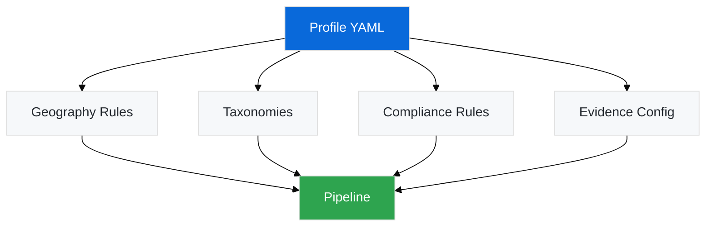

# Working with Refinement Profiles

Refinement profiles allow you to customize Watercrawl's validation rules, taxonomies, and compliance requirements for different industries or geographies.

## What are Profiles?

A refinement profile defines:

- **Geographic scope** (e.g., South Africa, specific provinces)
- **Industry taxonomies** (valid values for status, categories, etc.)
- **Compliance rules** (phone formatting, email validation, data protection)
- **Evidence requirements** (minimum sources, confidence thresholds)
- **Contact preferences** (preferred contact types, role priorities)



## Default Profile

The default profile is `za_flight_schools` (South African flight schools):

```yaml
# profiles/za_flight_schools.yaml
geography:
  country: "South Africa"
  provinces:
    - "Eastern Cape"
    - "Free State"
    - "Gauteng"
    - "KwaZulu-Natal"
    - "Limpopo"
    - "Mpumalanga"
    - "Northern Cape"
    - "North West"
    - "Western Cape"

taxonomies:
  status:
    - "Verified"
    - "Candidate"
    - "Needs Review"
    - "Duplicate"
    - "Do Not Contact (Compliance)"

compliance:
  phone_format: "E.164"
  phone_prefix: "+27"
  email_mx_validation: true
  popia_compliance: true

evidence:
  min_sources: 2
  min_confidence: 70
  require_official_source: true
  require_fresh_evidence: true

contact_priorities:
  - "Senior Management"
  - "Department Head"
  - "Named Individual"
  - "General Contact"
```

## Creating a Custom Profile

### Step 1: Copy the Template

```bash
cp profiles/za_flight_schools.yaml profiles/my_industry.yaml
```

### Step 2: Edit Geography

Update country, provinces/states, or regions:

```yaml
geography:
  country: "Australia"
  states:
    - "New South Wales"
    - "Victoria"
    - "Queensland"
    # Add remaining states
```

### Step 3: Define Taxonomies

Add or modify valid status values:

```yaml
taxonomies:
  status:
    - "Active"
    - "Inactive"
    - "Pending Verification"
    - "Archived"
  
  # Add custom taxonomies
  industry_sector:
    - "Manufacturing"
    - "Services"
    - "Retail"
```

### Step 4: Configure Compliance

Adjust phone formatting and validation rules:

```yaml
compliance:
  phone_format: "E.164"
  phone_prefix: "+61"  # Australia
  email_mx_validation: true
  gdpr_compliance: true  # Use GDPR instead of POPIA
```

### Step 5: Set Evidence Requirements

Tune quality thresholds:

```yaml
evidence:
  min_sources: 3  # Require 3 sources (stricter)
  min_confidence: 80  # Higher confidence threshold
  require_official_source: true
  require_fresh_evidence: false  # Allow stale evidence
```

## Using Custom Profiles

### Via Environment Variable

```bash
export REFINEMENT_PROFILE=my_industry
poetry run python -m apps.analyst.cli enrich data/input.csv
```

### Via Direct Path

```bash
export REFINEMENT_PROFILE_PATH=profiles/my_industry.yaml
poetry run python -m apps.analyst.cli enrich data/input.csv
```

### Via CLI Flag

```bash
poetry run python -m apps.analyst.cli enrich \
  --profile my_industry \
  data/input.csv \
  --output data/enriched.csv
```

## Profile Validation

Validate your profile before using it:

```bash
poetry run python -c "
from watercrawl.core.config import load_profile
profile = load_profile('my_industry')
print(f'Profile loaded: {profile.geography.country}')
print(f'Valid provinces: {profile.geography.provinces}')
"
```

## Advanced Profile Features

### Multi-Geography Profiles

Support multiple regions in one profile:

```yaml
geography:
  regions:
    - name: "Eastern Region"
      provinces: ["Eastern Cape", "KwaZulu-Natal"]
    - name: "Western Region"
      provinces: ["Western Cape", "Northern Cape"]
```

### Industry-Specific Validators

Add custom validation functions:

```python
# profiles/validators/aviation.py
def validate_aviation_license(value: str) -> bool:
    """Validate aviation license format."""
    return bool(re.match(r'^[A-Z]{2}\d{6}$', value))
```

Reference in profile:

```yaml
custom_validators:
  - name: "aviation_license"
    module: "profiles.validators.aviation"
    function: "validate_aviation_license"
```

### Contact Role Mapping

Define role priorities for your industry:

```yaml
contact_priorities:
  roles:
    - title: "Chief Technology Officer"
      priority: 1
    - title: "Engineering Manager"
      priority: 2
    - title: "Technical Lead"
      priority: 3
    - title: "General Contact"
      priority: 10
```

## Profile Testing

Test your profile with sample data:

```bash
# Create test dataset matching your profile
poetry run python -m scripts.create_test_data \
  --profile my_industry \
  --output data/test_my_industry.csv

# Run validation
poetry run python -m apps.analyst.cli validate \
  --profile my_industry \
  data/test_my_industry.csv

# Run enrichment
poetry run python -m apps.analyst.cli enrich \
  --profile my_industry \
  data/test_my_industry.csv \
  --output data/test_enriched.csv
```

## Profile Registry

List available profiles:

```bash
ls -la profiles/
# Output:
# za_flight_schools.yaml
# my_industry.yaml
# example_profile.yaml
```

View profile details:

```bash
poetry run python -m apps.analyst.cli list-profiles
```

## Best Practices

1. **Start from Template**: Always base new profiles on existing ones
2. **Validate Early**: Test profile with small datasets before production
3. **Document Changes**: Add comments explaining custom rules
4. **Version Control**: Track profile changes in git
5. **Test Thoroughly**: Run full QA suite with profile-specific tests

## Common Use Cases

### Healthcare Organizations

```yaml
geography:
  country: "South Africa"
  provinces: ["Gauteng", "Western Cape"]

taxonomies:
  status: ["Active", "Inactive", "Under Review"]
  facility_type: ["Hospital", "Clinic", "Laboratory"]

compliance:
  popia_compliance: true
  hipaa_compliance: false  # Not applicable in SA
  patient_data_handling: true
```

### Educational Institutions

```yaml
geography:
  country: "South Africa"
  
taxonomies:
  institution_type: ["University", "College", "School"]
  accreditation_status: ["Accredited", "Provisional", "Not Accredited"]

contact_priorities:
  - "Vice-Chancellor"
  - "Dean"
  - "Department Head"
  - "Administrative Contact"
```

### Manufacturing Companies

```yaml
taxonomies:
  company_size: ["Small", "Medium", "Large", "Enterprise"]
  certification: ["ISO9001", "ISO14001", "None"]

evidence:
  min_sources: 3  # Manufacturing requires more evidence
  require_official_source: true
```

## Troubleshooting

### Profile Not Found

```bash
# Check profile exists
ls profiles/my_industry.yaml

# Check environment variable
echo $REFINEMENT_PROFILE_PATH
```

### Validation Errors

```bash
# View detailed validation errors
poetry run python -m apps.analyst.cli validate \
  --profile my_industry \
  --verbose \
  data/input.csv
```

### Taxonomy Mismatches

Ensure input data uses values from profile taxonomies:

```python
# Check valid status values
poetry run python -c "
from watercrawl.core.config import load_profile
profile = load_profile('my_industry')
print('Valid statuses:', profile.taxonomies['status'])
"
```

## Next Steps

- **[First Enrichment Tutorial](/guides/tutorials/first-enrichment/)** - Apply your profile
- **[MCP Setup](/guides/tutorials/mcp-setup/)** - Use profiles with AI assistance
- **[Configuration Reference](/reference/configuration/)** - All profile options

---

**Need help?** Check the [Troubleshooting Guide](/guides/troubleshooting/) or [create an issue](https://github.com/IAmJonoBo/watercrawl/issues).
