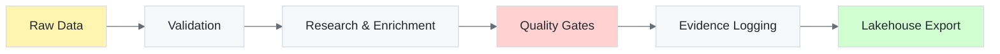

<!--
markdownlint-disable MD025 MD033 MD041
-->
---
title: Watercrawl Documentation
description: Evidence-backed data enrichment and OSINT research toolkit for South African flight schools
template: splash
hero:
  title: |
    <span style="background: linear-gradient(90deg, #0969da 0%, #1f6feb 100%); -webkit-background-clip: text; -webkit-text-fill-color: transparent;">Watercrawl</span>
  tagline: Production-grade data enrichment toolkit with POPIA compliance, evidence-backed research, and AI-powered workflows
  image:
    file: ../../assets/hero.svg
  actions:
    - text: Get Started
      link: /guides/getting-started/
      icon: right-arrow
      variant: primary
    - text: View on GitHub
      link: https://github.com/IAmJonoBo/watercrawl
      icon: external
---

import { Card, CardGrid } from "@astrojs/starlight/components";

## What is Watercrawl?

Watercrawl (formerly ACES Aerodynamics Enrichment Stack) is a **modular, compliance-driven pipeline** for B2B data enrichment and OSINT research. Built with **Python 3.13+**, it transforms raw flight-school datasets into validated, evidence-backed records that comply with **POPIA** (Protection of Personal Information Act) and **SACAA** (South African Civil Aviation Authority) requirements.



## Core Capabilities

<CardGrid stagger>
  <Card title="🔍 Intelligent Research" icon="magnifier">
    Automated OSINT with multi-source triangulation, confidence scoring, and evidence-backed findings from regulators, press, and directories.
  </Card>
  
  <Card title="✅ Compliance First" icon="approve-check">
    Built-in POPIA s69 compliance, E.164 phone formatting, MX record validation, and South African provincial taxonomy enforcement.
  </Card>
  
  <Card title="📊 Quality Contracts" icon="open-book">
    Dual Great Expectations + dbt suite with automated sanity checks, drift detection, and graph semantics validation.
  </Card>
  
  <Card title="🤖 AI Integration" icon="rocket">
    Model Context Protocol (MCP) server for GitHub Copilot automation with plan→commit guardrails and RAG safety checks.
  </Card>
  
  <Card title="📈 Data Lineage" icon="list-format">
    OpenLineage, PROV-O, and DCAT artifacts for full provenance tracking with versioned lakehouse snapshots.
  </Card>
  
  <Card title="🔒 Security Hardening" icon="shield">
    Sigstore artifact signing, CycloneDX SBOMs, OpenSSF Scorecard monitoring, and secrets management abstraction.
  </Card>
</CardGrid>

## Quick Start

```bash
# Bootstrap environment and install dependencies
python -m scripts.bootstrap_env

# Validate a dataset
poetry run python -m apps.analyst.cli validate data/sample.csv

# Enrich with evidence logging
poetry run python -m apps.analyst.cli enrich data/sample.csv \
  --output data/enriched.csv \
  --evidence-log data/evidence_log.csv

# Run data contracts
poetry run python -m apps.analyst.cli contracts data/enriched.csv
```

## Documentation Structure

Our documentation follows the **Diátaxis framework** for systematic technical documentation:

### 📚 Tutorials (Learning-Oriented)

<CardGrid>
  <Card title="Getting Started" icon="star">
    [Step-by-step guide](/guides/getting-started/) for new users to set up and run their first enrichment pipeline.
  </Card>
  
  <Card title="First Enrichment" icon="pencil">
    [Tutorial](/guides/tutorials/first-enrichment/) on enriching a sample dataset with evidence logging.
  </Card>
</CardGrid>

### 🛠️ How-To Guides (Problem-Oriented)

<CardGrid>
  <Card title="CLI Commands" icon="terminal">
    [Practical guides](/cli/) for validation, enrichment, and contract execution.
  </Card>
  
  <Card title="MCP Integration" icon="puzzle">
    [Configure GitHub Copilot](/mcp/) with the MCP server for AI-assisted workflows.
  </Card>
  
  <Card title="Troubleshooting" icon="warning">
    [Common issues](/guides/troubleshooting/) and their solutions.
  </Card>
</CardGrid>

### 📖 Reference (Information-Oriented)

<CardGrid>
  <Card title="API Reference" icon="document">
    [Complete API documentation](/reference/api/) for all public modules and interfaces.
  </Card>
  
  <Card title="Configuration" icon="setting">
    [Environment variables](/reference/configuration/) and feature flags reference.
  </Card>
  
  <Card title="Data Contracts" icon="list-format">
    [Schema specifications](/reference/data-contracts/) for input/output formats.
  </Card>
</CardGrid>

### 💡 Explanation (Understanding-Oriented)

<CardGrid>
  <Card title="Architecture" icon="puzzle">
    [System design](/architecture/) and component relationships.
  </Card>
  
  <Card title="Data Quality" icon="approve-check">
    [Research methodologies](/data-quality/) and validation strategies.
  </Card>
  
  <Card title="Lineage & Lakehouse" icon="list-format">
    [Provenance tracking](/lineage-lakehouse/) and analytics architecture.
  </Card>
  
  <Card title="ADRs" icon="document">
    [Architecture Decision Records](/adr/) documenting key design choices.
  </Card>
</CardGrid>

## Technology Stack

- **Python 3.13+**: Modern async/await patterns and type hints
- **Poetry**: Dependency management with lockfile reproducibility
- **dbt + Great Expectations**: Data quality contracts and validation
- **Pint**: Unit-aware data processing
- **OpenLineage + PROV-O**: Data lineage and provenance
- **MCP**: Model Context Protocol for AI integration
- **Sigstore**: Supply chain security and artifact signing

## Community & Support

- **GitHub**: [IAmJonoBo/watercrawl](https://github.com/IAmJonoBo/watercrawl)
- **Issues**: [Report bugs or request features](https://github.com/IAmJonoBo/watercrawl/issues)
- **Contributing**: See our [contribution guidelines](https://github.com/IAmJonoBo/watercrawl/blob/main/CONTRIBUTING.md)

---

**Ready to get started?** Follow our [Getting Started Guide](/guides/getting-started/) to begin enriching your datasets with confidence.
