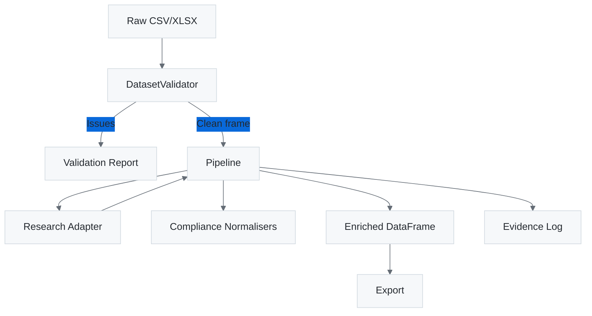

# ACES Aerodynamics Enrichment Stack

Welcome to the consolidated intelligence and enrichment toolkit for ACES Aerodynamics. This stack transforms raw flight-school datasets into fully validated, evidence-backed records aligned with POPIA and SACAA expectations.

## Overview

The ACES Enrichment Stack is a modular, compliance-driven pipeline for B2B data enrichment and OSINT research focused on South African flight schools. Built with Python 3.13, it leverages modern tools like Poetry for dependency management, dbt for data transformation, Great Expectations for data quality, and MCP for AI-assisted workflows.

## Key Features

- **🔍 Intelligent Research**: Automated OSINT gathering with triangulation from multiple sources
- **✅ Data Validation**: South African provincial and aviation industry compliance checks
- **📊 Quality Assurance**: Great Expectations suites and dbt data contracts
- **🤖 AI Integration**: MCP server for GitHub Copilot automation
- **📈 Analytics**: Lakehouse architecture with lineage tracking
- **🔒 Compliance**: POPIA and data protection compliance built-in

## Quick Start

```bash
# Install dependencies
pip install -r requirements.txt

# Run enrichment pipeline
python -m app.cli enrich --input data/sample.csv --output results/

# Start MCP server for AI integration
python -m firecrawl_demo.interfaces.mcp.server
```

## Architecture



## Documentation Sections

import { Card, CardGrid } from "@astrojs/starlight/components";

<CardGrid>
  <Card title="Architecture" icon="document">
    Learn about the layered design and data flow patterns.
  </Card>
  <Card title="CLI Guide" icon="terminal">
    Command-line interface for analysts and developers.
  </Card>
  <Card title="Data Quality" icon="data">
    Validation rules and research methodologies.
  </Card>
  <Card title="MCP Integration" icon="robot">
    AI-assisted workflows with GitHub Copilot.
  </Card>
  <Card title="Operations" icon="gear">
    Quality gates and maintenance procedures.
  </Card>
  <Card title="Lakehouse" icon="database">
    Data lineage and analytics architecture.
  </Card>
</CardGrid>
