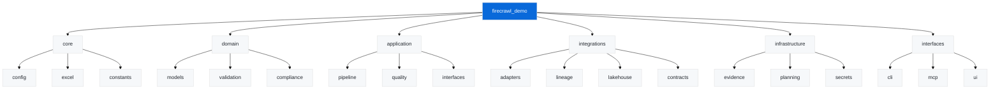

# API Reference

This reference documents all public APIs in Watercrawl. Internal implementation details (prefixed with `_`) are not included.

## Module Organization



## Core Modules

### firecrawl_demo.core.config

Configuration management and environment variable handling.

#### `get_config() -> Config`

Returns the global configuration instance.

```python
from firecrawl_demo.core.config import get_config

config = get_config()
print(config.feature_enable_firecrawl_sdk)  # bool
print(config.refinement_profile)  # str
```

#### `Config` (dataclass)

```python
@dataclass
class Config:
    # Feature flags
    feature_enable_firecrawl_sdk: bool
    allow_network_research: bool
    feature_enable_press_research: bool
    feature_enable_regulator_lookup: bool
    feature_investigate_rebrands: bool
    
    # Profile
    refinement_profile: str
    refinement_profile_path: Optional[str]
    
    # Evidence
    evidence_min_confidence: int
    evidence_min_sources: int
    evidence_require_official: bool
    evidence_require_fresh: bool
    
    # Paths
    evidence_log_path: Path
    lineage_output_dir: Path
    lakehouse_root: Path
    versioning_root: Path
```

### firecrawl_demo.core.excel

CSV/XLSX reading and writing utilities.

#### `read_dataset(path: Path) -> pd.DataFrame`

Load a dataset from CSV or XLSX.

```python
from firecrawl_demo.core.excel import read_dataset

df = read_dataset(Path("data/sample.csv"))
```

**Parameters:**
- `path`: Path to CSV or XLSX file

**Returns:** pandas DataFrame with standardized column names

**Raises:**
- `FileNotFoundError`: If file doesn't exist
- `ValueError`: If file format is unsupported

#### `write_dataset(df: pd.DataFrame, path: Path, format: str = "csv") -> None`

Write a dataset to CSV or XLSX.

```python
from firecrawl_demo.core.excel import write_dataset

write_dataset(df, Path("output.csv"), format="csv")
```

## Domain Layer

### firecrawl_demo.domain.models

Core domain models representing business entities.

#### `Organisation` (dataclass)

```python
@dataclass
class Organisation:
    name: str
    province: str
    status: str
    website: Optional[str] = None
    contact_person: Optional[str] = None
    contact_number: Optional[str] = None
    contact_email: Optional[str] = None
    
    def validate(self) -> List[ValidationIssue]:
        """Validate organisation data."""
        ...
    
    def to_dict(self) -> Dict[str, Any]:
        """Convert to dictionary."""
        ...
```

#### `EvidenceRecord` (dataclass)

```python
@dataclass
class EvidenceRecord:
    row_id: str
    organisation: str
    changes: Dict[str, Any]
    sources: List[str]
    notes: str
    timestamp: datetime
    confidence: int
    
    def to_csv_row(self) -> Dict[str, str]:
        """Convert to CSV row format."""
        ...
```

### firecrawl_demo.domain.validation

Dataset validation rules and validators.

#### `DatasetValidator`

```python
class DatasetValidator:
    def __init__(self, profile: RefinementProfile):
        """Initialize validator with profile."""
        ...
    
    def validate(self, df: pd.DataFrame) -> ValidationReport:
        """Validate entire dataset."""
        ...
    
    def validate_provinces(self, df: pd.DataFrame) -> List[ValidationIssue]:
        """Validate South African provinces."""
        ...
    
    def validate_phones(self, df: pd.DataFrame) -> List[ValidationIssue]:
        """Validate E.164 phone formatting."""
        ...
    
    def validate_emails(self, df: pd.DataFrame) -> List[ValidationIssue]:
        """Validate email addresses and MX records."""
        ...
```

**Usage:**

```python
from firecrawl_demo.domain.validation import DatasetValidator
from firecrawl_demo.core.config import load_profile

profile = load_profile("za_flight_schools")
validator = DatasetValidator(profile)
report = validator.validate(df)

if report.has_issues():
    for issue in report.issues:
        print(f"{issue.severity}: {issue.message}")
```

#### `ValidationReport` (dataclass)

```python
@dataclass
class ValidationReport:
    issues: List[ValidationIssue]
    warnings_count: int
    errors_count: int
    
    def has_issues(self) -> bool:
        """Check if any issues exist."""
        ...
    
    def has_errors(self) -> bool:
        """Check if any errors exist."""
        ...
    
    def to_dict(self) -> Dict[str, Any]:
        """Convert to dictionary."""
        ...
```

### firecrawl_demo.domain.compliance

POPIA and SACAA compliance utilities.

#### `normalize_phone_e164(phone: str) -> str`

Normalize phone number to E.164 format.

```python
from firecrawl_demo.domain.compliance import normalize_phone_e164

normalized = normalize_phone_e164("0123456789")  # "+27123456789"
```

#### `validate_mx_records(email: str) -> bool`

Check if email domain has valid MX records.

```python
from firecrawl_demo.domain.compliance import validate_mx_records

valid = validate_mx_records("info@example.aero")  # True/False
```

## Application Layer

### firecrawl_demo.application.pipeline

Main enrichment pipeline orchestrator.

#### `Pipeline`

```python
class Pipeline:
    def __init__(
        self,
        validator: DatasetValidator,
        research_adapter: ResearchAdapter,
        quality_gate: QualityGate,
        evidence_sink: EvidenceSink,
    ):
        """Initialize pipeline with dependencies."""
        ...
    
    async def run(
        self,
        df: pd.DataFrame,
        progress_callback: Optional[Callable] = None
    ) -> PipelineReport:
        """Run enrichment pipeline."""
        ...
    
    async def validate_only(self, df: pd.DataFrame) -> ValidationReport:
        """Run validation without enrichment."""
        ...
```

**Usage:**

```python
from firecrawl_demo.application.pipeline import Pipeline, build_pipeline

# Build with default dependencies
pipeline = build_pipeline()

# Run enrichment
report = await pipeline.run(df)
print(f"Processed {report.total_rows} rows")
print(f"Updated {report.rows_updated} rows")
```

#### `PipelineReport` (dataclass)

```python
@dataclass
class PipelineReport:
    total_rows: int
    rows_updated: int
    rows_rejected: int
    rows_unchanged: int
    quality_rejections: int
    evidence_records: int
    adapter_failures: int
    sanity_issues: int
    drift_alerts: int
    execution_time_seconds: float
    
    def to_dict(self) -> Dict[str, Any]:
        """Convert to dictionary."""
        ...
```

### firecrawl_demo.application.quality

Quality gate for evaluating enrichment findings.

#### `QualityGate`

```python
class QualityGate:
    def __init__(
        self,
        min_confidence: int = 70,
        min_sources: int = 2,
        require_official: bool = True,
        require_fresh: bool = True,
    ):
        """Initialize quality gate with thresholds."""
        ...
    
    def evaluate(
        self,
        finding: ResearchFinding,
        existing_evidence: List[EvidenceRecord]
    ) -> QualityDecision:
        """Evaluate if finding meets quality criteria."""
        ...
```

#### `QualityDecision` (dataclass)

```python
@dataclass
class QualityDecision:
    approved: bool
    reasons: List[str]
    remediation_notes: Optional[str]
    
    def is_approved(self) -> bool:
        """Check if approved."""
        return self.approved
```

## Integrations Layer

### firecrawl_demo.integrations.adapters.research

Research adapter interfaces and implementations.

#### `ResearchAdapter` (Protocol)

```python
class ResearchAdapter(Protocol):
    async def lookup(
        self,
        organisation: str,
        province: str
    ) -> Optional[ResearchFinding]:
        """Lookup organisation details."""
        ...
```

#### `ResearchFinding` (dataclass)

```python
@dataclass
class ResearchFinding:
    website: Optional[str] = None
    contact_person: Optional[str] = None
    contact_number: Optional[str] = None
    contact_email: Optional[str] = None
    sources: List[str] = field(default_factory=list)
    confidence: int = 0
    notes: Optional[str] = None
    
    def to_dict(self) -> Dict[str, Any]:
        """Convert to dictionary."""
        ...
```

#### Registry Functions

```python
def register_adapter(name: str, factory: Callable) -> None:
    """Register a research adapter."""
    ...

def load_enabled_adapters() -> ResearchAdapter:
    """Load enabled adapters as composite."""
    ...
```

**Usage:**

```python
from firecrawl_demo.integrations.adapters.research import (
    register_adapter,
    load_enabled_adapters,
    ResearchAdapter,
    ResearchFinding,
)

# Register custom adapter
def my_adapter_factory(ctx):
    return MyCustomAdapter()

register_adapter("custom", my_adapter_factory)

# Load composite adapter
adapter = load_enabled_adapters()
finding = await adapter.lookup("SA Flight Academy", "Gauteng")
```

### firecrawl_demo.integrations.lineage

OpenLineage, PROV-O, and DCAT lineage tracking.

#### `LineageManager`

```python
class LineageManager:
    def __init__(self, run_id: str, output_dir: Path):
        """Initialize lineage manager."""
        ...
    
    def emit_run_event(
        self,
        run_id: str,
        job_name: str,
        inputs: List[Path],
        outputs: List[Path],
        metadata: Dict[str, Any]
    ) -> None:
        """Emit OpenLineage run event."""
        ...
    
    def generate_prov_graph(
        self,
        run_id: str,
        agent: str,
        inputs: List[Path],
        outputs: List[Path]
    ) -> str:
        """Generate PROV-O RDF graph."""
        ...
```

## Infrastructure Layer

### firecrawl_demo.infrastructure.evidence

Evidence sink implementations.

#### `EvidenceSink` (Protocol)

```python
class EvidenceSink(Protocol):
    async def log_evidence(self, record: EvidenceRecord) -> None:
        """Log evidence record."""
        ...
```

#### `CSVEvidenceSink`

```python
class CSVEvidenceSink:
    def __init__(self, log_path: Path):
        """Initialize CSV evidence sink."""
        ...
    
    async def log_evidence(self, record: EvidenceRecord) -> None:
        """Append evidence to CSV log."""
        ...
```

### firecrawl_demo.infrastructure.secrets

Secrets management for multiple backends.

#### `SecretsProvider`

```python
class SecretsProvider:
    def __init__(self, backend: str = "env"):
        """Initialize secrets provider.
        
        Args:
            backend: One of 'env', 'aws', 'azure'
        """
        ...
    
    def get_secret(self, key: str, default: Optional[str] = None) -> Optional[str]:
        """Get secret value."""
        ...
    
    def get_required_secret(self, key: str) -> str:
        """Get secret value (raises if not found)."""
        ...
```

## Interfaces Layer

### firecrawl_demo.interfaces.cli

Command-line interface for analysts.

See [CLI Guide](/cli/) for detailed command documentation.

### firecrawl_demo.interfaces.mcp

Model Context Protocol server for GitHub Copilot.

See [MCP Integration](/mcp/) for detailed integration guide.

## Type Hints & Protocols

Watercrawl uses modern Python type hints throughout. Key protocols:

```python
from typing import Protocol, Optional, List, Dict, Any

class ResearchAdapter(Protocol):
    """Protocol for research adapters."""
    async def lookup(self, organisation: str, province: str) -> Optional[ResearchFinding]:
        ...

class EvidenceSink(Protocol):
    """Protocol for evidence logging."""
    async def log_evidence(self, record: EvidenceRecord) -> None:
        ...

class ProgressCallback(Protocol):
    """Protocol for progress reporting."""
    def __call__(self, current: int, total: int, message: str) -> None:
        ...
```

## Error Handling

Common exceptions:

```python
from firecrawl_demo.domain.validation import ValidationError
from firecrawl_demo.application.pipeline import PipelineError
from firecrawl_demo.integrations.adapters.research import AdapterError

try:
    report = await pipeline.run(df)
except ValidationError as e:
    print(f"Validation failed: {e}")
except AdapterError as e:
    print(f"Adapter failed: {e}")
except PipelineError as e:
    print(f"Pipeline failed: {e}")
```

## Testing Utilities

### Fixtures and Mocks

```python
from firecrawl_demo.testing import (
    create_sample_dataframe,
    MockResearchAdapter,
    MockEvidenceSink,
)

# Create test data
df = create_sample_dataframe(num_rows=10)

# Use mock adapter
adapter = MockResearchAdapter(
    findings={
        "SA Flight Academy": ResearchFinding(
            website="https://example.aero",
            confidence=90,
            sources=["https://official.gov", "https://secondary.com"]
        )
    }
)
```

## Next Steps

- **[Configuration Reference](/reference/configuration/)** - Environment variables
- **[Data Contracts Reference](/reference/data-contracts/)** - Schema specifications
- **[CLI Guide](/cli/)** - Command-line usage
- **[Troubleshooting](/guides/troubleshooting/)** - Common issues

---

**Need more details?** View the source code at [github.com/IAmJonoBo/watercrawl](https://github.com/IAmJonoBo/watercrawl) or [open an issue](https://github.com/IAmJonoBo/watercrawl/issues).
