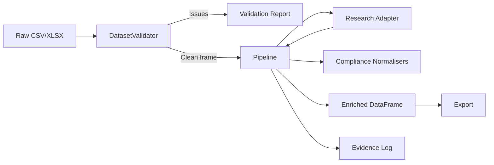

# Architecture Overview

## Layered Design

1. **Dataset Ingestion** (`firecrawl_demo.excel`)
   - Handles CSV/XLSX parity with a unified reader/writer.
   - Normalises sheet naming and preserves canonical column order.
2. **Validation Layer** (`firecrawl_demo.validation`)
   - Enforces South African provincial lists and ACES status taxonomy.
   - Emits structured `ValidationIssue` instances for UI/automation consumption.
3. **Research Adapter Layer** (`firecrawl_demo.research`)
   - Provides a protocol-driven interface so tests can inject deterministic findings while production can swap in Firecrawl or OSINT clients.
   - `TriangulatingResearchAdapter` merges Firecrawl, regulator, press, and directory intelligence governed by feature toggles.
4. **Compliance Utilities** (`firecrawl_demo.compliance`)
   - Normalises phone numbers to +27 E.164, verifies email domains against official websites, and calculates confidence scores.
5. **Pipeline Orchestrator** (`firecrawl_demo.pipeline`)
   - Applies validation, enrichment, evidence logging, and metrics collection.
   - Generates `PipelineReport` objects for CLI/MCP consumers.
6. **Interfaces**
   - **CLI** (`firecrawl_demo.cli`): human-friendly commands for validation and enrichment.
   - **MCP Server** (`firecrawl_demo.mcp.server`): JSON-RPC surface for GitHub Copilot automation.

## Data Flow

## Extensibility Points

- Implement a new `ResearchAdapter` to integrate different data sources (e.g., SACAA APIs, LinkedIn scraping, commercial datasets).
- Override `Pipeline.run_task` to expose additional automation tasks (e.g., province-only audits).
- Extend MkDocs with ADRs to capture decision history as the stack evolves.

### Research Adapter Registry

The `firecrawl_demo.research.registry` module centralises adapter discovery so new intelligence sources can be added without editing the core pipeline.

1. Author an adapter that implements the `ResearchAdapter` protocol (expose a `lookup(organisation, province)` method returning a `ResearchFinding`).
2. Register it during import with `register_adapter("my-adapter", my_factory)`. Factories receive an `AdapterContext` and should return a new adapter instance (or `None` when disabled).
3. Declare the execution order with configuration:
   - `RESEARCH_ADAPTERS="firecrawl,my-adapter,null"` for quick overrides.
   - Point `RESEARCH_ADAPTERS_FILE` to a YAML/TOML file containing an `adapters` list for more complex stacks.
4. When `load_enabled_adapters()` runs, the registry handles deduplication and feature-flag checks; `build_research_adapter()` ensures a Null adapter is used if every factory opts out.

This registry keeps `build_research_adapter()` thin while allowing optional modules (e.g., press intelligence, regulator lookups, ML enrichers) to live in their own packages.
