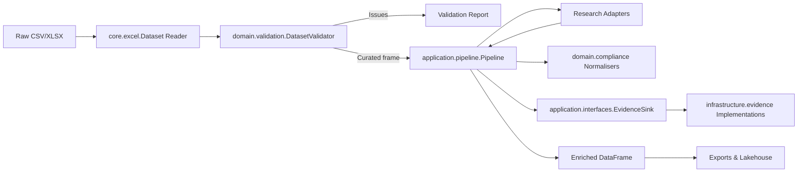

# Architecture Overview

## Layered Design

1. **Core Utilities** (`firecrawl_demo.core`)
   - Provides configuration, Excel I/O helpers, and shared constants used across the stack.
   - Normalises sheet naming, preserves canonical column order, and exposes deterministic file paths for artefact export.
2. **Domain Layer** (`firecrawl_demo.domain`)
   - Owns canonical models (`models`), validation rules (`validation`), and compliance heuristics (`compliance`).
   - Emits structured `ValidationReport`, `EvidenceRecord`, and `QualityIssue` objects that can be consumed without referencing persistence concerns.
3. **Application Layer** (`firecrawl_demo.application`)
   - Coordinates orchestration through the `pipeline`, `quality`, and `progress` modules.
   - Defines interfaces in `application.interfaces` so pipelines and evidence sinks can be swapped or decorated without touching domain logic.
4. **Integrations** (`firecrawl_demo.integrations`)
   - Research adapters, lineage capture, lakehouse writers, and contract runners live behind feature-flag friendly factories.
   - External systems plug into the application layer via protocols so deterministic offline adapters continue to drive the QA suite.
5. **Infrastructure** (`firecrawl_demo.infrastructure`)
   - Implements persistence for the application interfaces, including CSV/streaming evidence sinks and the infrastructure planning scaffold.
   - Keeps storage and deployment details decoupled from the pipeline so alternative sinks (e.g., Kafka, REST) can be introduced without disturbing core orchestration.
6. **Interfaces** (`firecrawl_demo.interfaces`)
   - CLI, analyst UI, and MCP surfaces build on the application layer to expose validated enrichment workflows to humans and GitHub Copilot.

> **Package boundaries.** `firecrawl_demo.domain` captures business invariants, `firecrawl_demo.application` orchestrates workflows against those invariants, `firecrawl_demo.infrastructure` persists artefacts, and `firecrawl_demo.integrations` houses optional systems (lineage, lakehouse, contracts, research). Production wheels still exclude development directories (`codex/`, `dev/`, `tools/`) so deployments remain lean.

## Data Flow

## Extensibility Points

- Implement a new `ResearchAdapter` to integrate additional data sources (SACAA APIs, commercial datasets, etc.).
- Provide an alternate `EvidenceSink` implementation in `firecrawl_demo.infrastructure.evidence` to stream audit events to Kafka, REST endpoints, or other telemetry systems.
- Override `Pipeline.run_task` to expose additional automation actions (province-only audits, contract summaries, etc.).
- Extend MkDocs with new ADRs to document architectural decisions as the stack evolves.

### Research Adapter Registry

The `firecrawl_demo.integrations.research.registry` module centralises adapter discovery so new intelligence sources can be added without editing the pipeline.

1. Author an adapter that implements the `ResearchAdapter` protocol (expose a `lookup(organisation, province)` method returning a `ResearchFinding`).
2. Register it during import with `register_adapter("my-adapter", my_factory)`. Factories receive an `AdapterContext` and should return a new adapter instance (or `None` when disabled).
3. Declare the execution order with configuration:
   - `RESEARCH_ADAPTERS="firecrawl,my-adapter,null"` for quick overrides.
   - Point `RESEARCH_ADAPTERS_FILE` to a YAML/TOML file containing an `adapters` list for more complex stacks.
4. When `load_enabled_adapters()` runs, the registry handles deduplication and feature-flag checks; `build_research_adapter()` ensures a Null adapter is used if every factory opts out.

This registry keeps `build_research_adapter()` thin while allowing optional modules (press intelligence, regulator lookups, ML enrichers) to live in their own packages.

### Infrastructure Plan Scaffold

The `firecrawl_demo.infrastructure.planning` module provides an `InfrastructurePlan` dataclass that aggregates crawler, observability, policy, and plan→commit expectations into a single contract.

- **CrawlerPlan** captures the frontier backend, scheduling policy, politeness delays, depth limits, trap-rule file, and user agent.
- **ObservabilityPlan** defines probe paths, SLO thresholds, and alert routes.
- **PolicyPlan** records the OPA bundle path, decision namespace, and enforcement mode.
- **PlanCommitContract** encodes the plan→commit guardrails for automation, including the audit topic used by the evidence sink and optional force-commit escape hatches.

Call `build_infrastructure_plan()` to obtain a frozen snapshot suitable for documentation exports, MCP tool manifests, or CI assertions before agents are allowed to crawl.

### Lineage & Lakehouse Services

- `firecrawl_demo.integrations.lineage` captures OpenLineage, PROV-O, and DCAT artefacts so provenance bundles accompany enriched datasets.
- `firecrawl_demo.integrations.lakehouse` snapshots curated tables to Parquet with manifest metadata, forming the foundation for future Delta Lake/Iceberg and DVC/lakeFS integrations.
